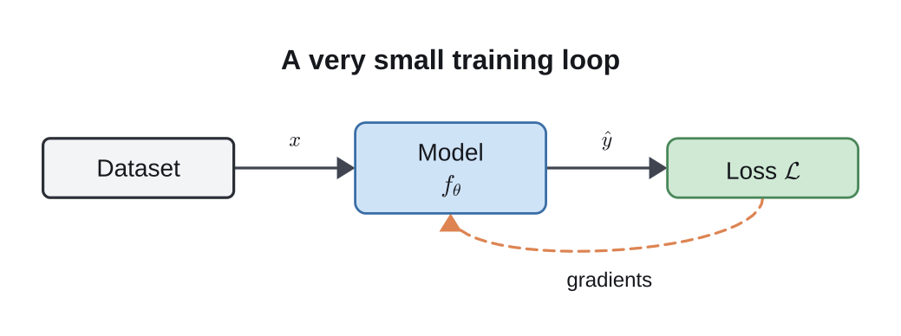
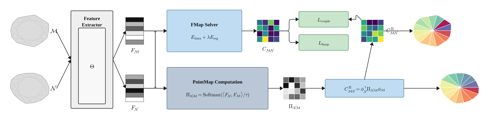
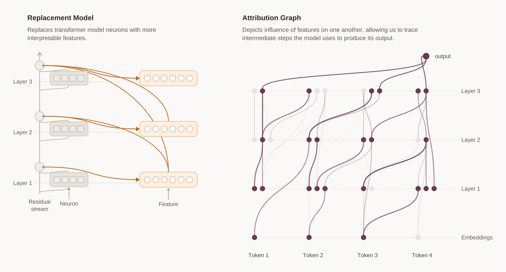
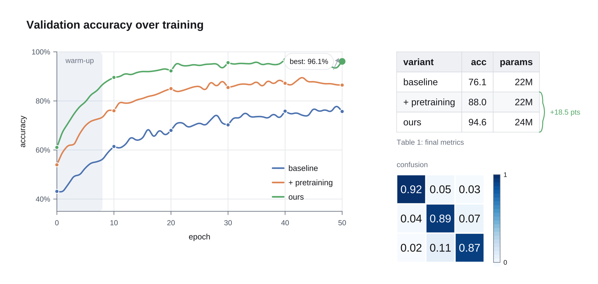
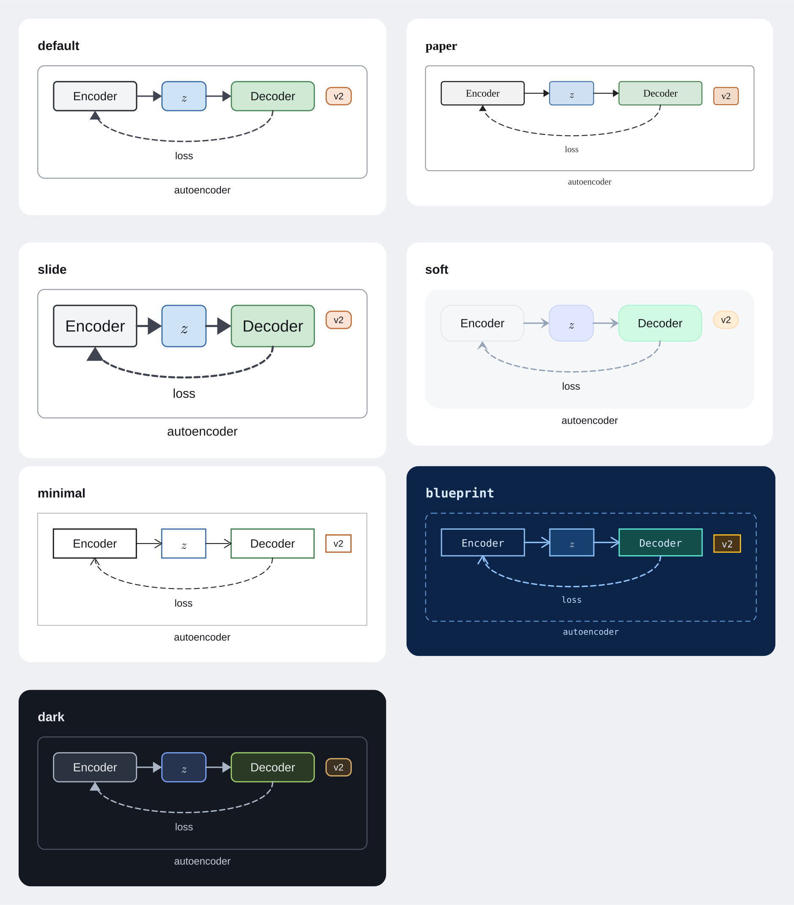

# figkit

**Design figures with Python code.** Boxes, arrows, LaTeX, images and data —
laid out precisely, styled by a cascading theme, exported to SVG, PNG, PDF or
HTML.

figkit is for the kind of figure you'd otherwise assemble by hand in Figma or
draw.io: ML paper pipelines, architecture diagrams, research blog explainers.
Except it's code, so it's diffable, reproducible, parameterisable — and an LLM
can write it for you (see [`AI_MANUAL.md`](AI_MANUAL.md)).

```python
from figkit import *

with Figure(pad=24) as fig:
    a = Box("Encoder", style="block", w=120)
    b = Box("Decoder", style="blue").right_of(a, gap=60)
    arrow(a.e, b.w, label="$z$")

fig.save("figure.svg")
fig.save("figure.png", scale=2)
```



---

## Install

```bash
pip install figkit              # core: layout, shapes, arrows, SVG/HTML export
pip install "figkit[latex]"     # + inline $math$ (matplotlib)
pip install "figkit[export]"    # + PNG/PDF export (cairosvg)
pip install "figkit[all]"       # everything
```

Only `fonttools` is required — it's what makes text measurement (and therefore
layout) accurate. PNG/PDF export also works with `rsvg-convert`, `resvg`,
`inkscape` or headless Chromium if you'd rather not install cairo.

---

## What it does

**Accurate measurement.** figkit reads the actual font file and measures glyph
advances, so `Box("Feature Extractor")` is exactly as wide as its text plus its
padding — and everything you place relative to it lands where you expect.

**Live anchors.** `box.e` is a reference, not a coordinate. Move the box and
every arrow attached to it follows.

```python
b = Box("model").right_of(a, gap=40)
link = arrow(a.e, b.w)
b.move(0, 120)          # the arrow follows
```

**Explicit placement, not auto-layout.** You say where things go; figkit does
the arithmetic.

```python
fm = Box("$F_M$").right_of(extractor, gap=24, align="top")
fn = Box("$F_N$").right_of(extractor, gap=24, align="bottom")
solver = Box("FMap Solver", style="blue").right_of(fm, gap=40)

elbow(fm.e, solver.w, stub=12)              # -| routing
mid = between(fm, fn)                        # vertically between two boxes
frame = fit(solver, cmn, pad=20, label="Fused operation", dash=True)
```

**Cascading themes.** Base tokens, per-role overrides, named styles and a
colour palette — set once, applied everywhere.

```python
T = PAPER.derive(
    font_size=13, radius=4,
    palette={"brand": "#3B6EA5"},
    box=Style(fill="#ffffff", stroke="#222222", padding=(9, 13)),
    styles={"solver": Style(fill="@brand", stroke="#1b1b1b")},
)
with Figure(theme=T) as fig:
    Box("FMap Solver", style="solver")
```

**LaTeX anywhere.** Any `$...$` span in any string is typeset and emitted as
vector outlines, so exported files don't depend on installed fonts.

```python
Box("$C_{\\mathcal{MN}} = \\phi^{\\dagger}_{\\mathcal{N}}\\Pi_{\\mathcal{NM}}\\phi_{\\mathcal{M}}$")
```

**Data is just Python.** A `Frame` maps data coordinates to figure
coordinates; every mark it draws is an ordinary element you can anchor to.

```python
fr = Frame(w=430, h=240, xlim=(0, 50), ylim=(0.35, 1.0))
fr.axes(xlabel="epoch", ylabel="accuracy", grid=True)
fr.line(xs, ys, stroke="@primary", lw=2)
arrow(note.se, fr.pt(50, 0.94))       # point at a data coordinate
```

---

## Gallery

Each figure below is produced by the script of the same name in
[`examples/`](examples/).

### `01_pipeline.py` — an ML paper pipeline

Themes, relative placement, live anchors, inline LaTeX, colour matrices,
elbow routing and hand-built vector graphics.



### `02_attribution.py` — a two-panel blog explainer

Programmatic node grids and hundreds of curved edges whose width and opacity
come straight from the data.



### `03_data_and_plots.py` — data-driven graphics

A coordinate frame, a legend, a table, a brace and a heatmap with a colour bar.



### `04_themes.py` — one diagram, seven themes

Not a single colour is set on an element — the theme cascade decides
everything.



---

## API tour

| | |
|---|---|
| **Canvas** | `Figure(w, h, pad, background, theme)`, `fig.save(...)`, `fig.to_svg()` |
| **Shapes** | `Box` `Pill` `Ellipse` `Circle` `Diamond` `Triangle` `Hexagon` `Parallelogram` `Chevron` `Star` `Cylinder` `Note` `Callout` |
| **Geometry** | `Line` `Polyline` `Polygon` `Path` `Dot` `Marker` |
| **Content** | `Text` `Label` `Image` |
| **Composites** | `Matrix` `Vector` `ColorBar` `Table` `Legend` `Brace` `Bracket` `Panel` `Group` `Spacer` |
| **Connectors** | `arrow` `line` `elbow` `curve` `connect` `double_arrow` |
| **Placement** | `at` `move` `center_at` `right_of` `left_of` `above_of` `below_of` `inside` `align_to` `span_x` `resize` `rotate` |
| **Layout** | `align` `distribute_h/v` `spread_h/v` `hstack` `vstack` `grid` `fit` `between` `center_on` `circular` `same_size` `bbox_of` |
| **Data** | `Frame` (`pt` `line` `scatter` `bars` `area_fill` `region` `axes` `gridlines`), `nice_ticks` |
| **Style** | `Style` `Theme` `use_theme`, themes `PAPER` `SLIDE` `DARK` `BLUEPRINT` `MINIMAL` `SOFT` |
| **Colour** | `mix` `lighten` `darken` `alpha` `colormap` `palette` `contrast_color` `to_hex` |

Anchors on every element: `n s e w ne nw se sw center`, plus `at_angle(deg)`,
`uv(u, v)` and offsets like `box.e + (6, 0)`.

---

## Design notes

* **Coordinates are px, y grows downward** — the SVG convention. `n` is the top.
* **The output is clean SVG.** No wrapper `<g>` soup, no embedded raster of
  your text: real `<text>` elements by default, real `<path>` outlines when you
  ask for `text_as_paths=True` (which PNG and PDF export do automatically).
* **Groups own their children.** `Group(a, b)` and `fit(a, b)` reparent, so the
  cluster moves as a unit. Use `bbox_of([a, b])` when you only want the bounds.
* **Text is centred optically**, on the cap-height band, which is what looks
  right for short labels in boxes.
* **No runtime layout engine.** Placement happens when you call it. That makes
  the code easy to reason about and easy to debug — print a `bbox` and you know
  exactly where something is.

---

## Development

```bash
pip install -e ".[dev]"
pytest                       # 169 tests, including a smoke test per example
python examples/01_pipeline.py
```

## License

MIT
